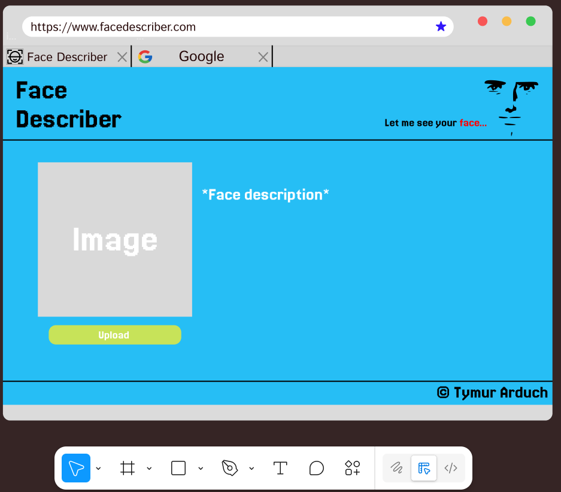
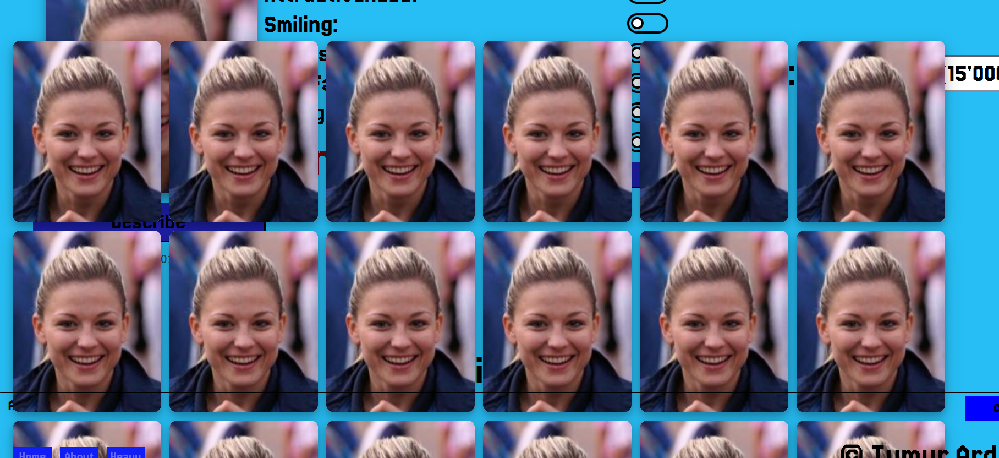
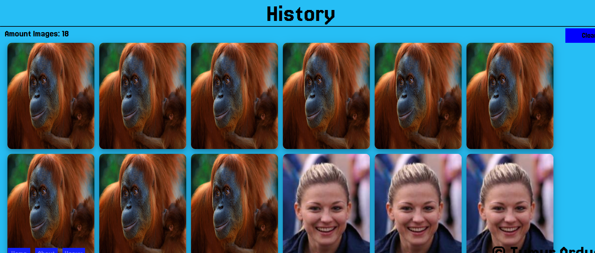

# Face Describer

### Problemstellung
Heutzutage sind die Menschen nicht bereit ihre  
eigenen Gesichter an die anderen bewerten zu lassen.  
Die Gründe sind: Schüchternheit, Verdammung und Angst.  

### Der Zweck
Die Sache ändert sich, wenn das eine Maschine macht.  
Sie fragt nicht, warum der Benutzer sein Gesicht unter- oder  
überbewertet und sie lacht nicht über den Benutzern.  
Die Maschine interessiert sich nur für die Pixel  
in der richtigen Reihenfolge und bewertet diese in  
Zahlen.

### Motivation
Solches KI-System programmiere ich nicht das erste Mal.  
Ich mag solche interessanten KI-Projekte zu erstellen,  
besonders, wenn sie den Menschen das Leben erleichtern könnten.  

### Projekt Entwicklung
#### Skizze
Als Erstes habe ich eine Skizze (Mischung vom Markup und Wireframe)  
für meine Webseite mithilfe von Figma erstellt:  
  
Daraus habe ich dann angefangen HTML und CSS einzurichten.  
Manchmal habe ich manche Punkte aus der Skizze weggelassen,  
aber das Endresultat sah relativ ähnlich aus:  
  
Auf diesem Bild kann man aber sehen, dass es mehrere Elemente als  
in der Skizze gibt. Der Screenshot ist einfach neu und wurde am  
Ende der Entwicklung aufgenommen.  

#### Zeit
Zeitlich waren 5 Wochen schon genug. Front-End habe ich  
in ca. 2 Tage geschrieben und Back-End war schon in einer Woche fertig.

#### Erfolge, Misserfolge und Erfahrungen
##### Front-End  
Ich habe HTML und CSS relativ "reibungslos" implementiert.
Daraus bekam ich auch viele Erfahrungen, meistens in CSS (z.B. flex, animations, hover).  
Manchmal musste ich viel denken wie ich "Loading Dots" und Bilder Geschichte implementieren  
kann, aber das habe ich geklappt.  
##### Back-End  
Eine Herausforderung für mich war die Kommunikation zwischen Servern mit HTTP-Requests.  
KI-Modell läuft ja auf Python Programmiersprache und Browser versteht nur JavaScript.  
Darum musste ich einen zweiten Spring-Boot Server für Python-Code Kompilation und Kommunikation  
aufbauen und Fetch implementieren. Aber ich habe Fetch-Requests gut wiederholt.  
Dann bin ich dazu gekommen, dass ich viele verschiedene KI-Modelle zum Ausprobieren habe  
und ich muss sie irgendwie vorstellen und mit Feedbacks verbessern. Das war nicht eine  
leichte Aufgabe, ich musste noch viel Fetches hinzufügen und mehrere Änderungen zu meinem  
Controller auf dem Spring-Server machen.  

#### Die alten Fehler vermeiden
Nächstes Mal, wenn ich ein ähnliches Projekt machen würde, würde ich die Änderungen auch in  
die Skizze beibringen, wenn ich die in meinem Projekt machen würde.  
Die Diagramme wie Komponentendiagramm wäre auch hilfreich, wenn es mehrere Komponenten gibt,  
was in meinem Projekt der Fall ist.  

### Technische Dokumentation
#### Front-End Struktur
Front-End braucht eine visuelle Darstellung (CSS und HTML). Dieser Schritt habe ich als erstes  
gemacht. In React gibt es drei Komponenten: Page.jsx (Hauptseite), About.jsx, Warum.jsx (Witz-Seite).  
Diese Komponenten enthälten all HTML und sind dann in App.jsx Komponente dargestellt.  
Für CSS gibt es nur eine Datei: index.css, dort sind alle CSS Änderungen drinnen.
HTML Struktur ist meistens auf "div" Tags basierend, es gibt auch header, body und footer.

#### Back-End Struktur
Als Back-End habe ich einen Spring-Boot Server, es enthält: 2 Kontroller (eins für Bilder und eins für Feedbacks),  
WebConfig, ".py" Datei (Python), Ordnern für Modellen, Feedbacks, Bilder von den Gesichtern und CSV-Tabellen  
(Um Feedback in training data hinzuzufügen).  

#### Front-End Technologien
Ich habe fast keine externe angewendet Bibliotheken, ausser "react-router-dom" für Routing und  
"axios" für Fetch-Requests.  

#### Back-End Technologien
Grundsätzlich habe ich Spring-Boot verwendet und dazugehörige Extensions wie: Controller, IOException,  
Configuration, und POST/GET Mapping. Für Python habe ich Machine Learning Framework TensorFlow importiert  
und auch andere nötige Bibliotheken zur Bearbeitung von Daten wie: numpy, pandas, PIL.

#### Problem Lösung Beispiele
Es gibt die Implementierung von: Bilder Hochladen, HTTP-Requests (mit Fetch), Loading dots,  
Feedback, Routing und KI-Modell Auswahl Möglichkeit.  
Aber es gibt ein Problem bei der Geschichte implementierung. Die Geschichte ist einfach eine  
Liste mit useState(), die Links enthält und hinzufügt, wenn der Knopf "Describe" gedrückt wird.  
Und es macht es auch dann, wenn die Breite nicht mehr reicht und darum gibt es sowas:  
  
Damit es nicht passiert habe ich eine Bedingung für Hinzufügen von neuen Links geschrieben:  
  
In diesem Code wird überprüft, ob die Anzahl von Links in der Geschichte mehr als 11 ist  
(das ist die Zahl, wenn es keinen Platz mehr für die Bilder gibt) und wenn Ja, dann wird  
der erste Link gelöscht, und das Neue am Ende hinzugefügt. So sieht die Geschichte nach  
Änderung:  

### Resultat und Evaluation
#### Wurde das Ziel erreicht?  
Einerseits habe ich es geschafft Grundnutzen dieser Webseite zu realisieren (Gesichter bewerten),  
andererseits gibt es noch immer Luft nach oben. Zum Beispiel ich könnte noch Webcamera zugriff implementieren  
oder die Schritte von Bewertung der Bilder visualisieren (Feature Maps zeigen).  
Aber grundsätzlich ist das Ziel erreicht.

### Quellenangaben
Literatur: Keine
Tutorials: selber gemacht
Webseiten: https://www.w3schools.com/, https://github.com/

GitHub Repository vom Projekt: https://github.com/Timure228/portfolio_face_describer  

Prompts (ChatGPT):   
1. `When I scroll to the right, to or bottom the web page ist 
continuos to go further, but there is nothing to show.`
`
2. `How can I hande a CORS error in Spring Boot, when I fetch it from Vite+React.`
3. `Write a code for loading dots untill the fetch is done.`
4. `How to send a POST-Request to Spring-Boot and give it to Python.`
5. 